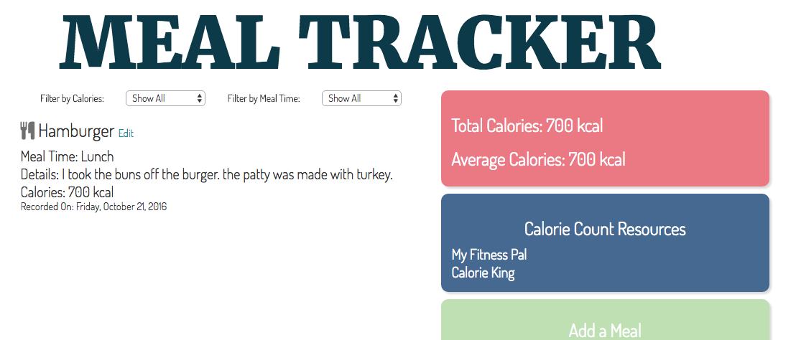

#Meal Tracker
####_Joanna Anderson_
##Description
This application allows users to keep track of their daily meal consumption. Users input the meal name, details, and calories. The application allows you to filter by calorie amount and meal time (Breakfast, Lunch, Dinner, Snack). The application also displays the user's total and average calorie consumption for the day.

##Installation Guide
**To download the project**
1. Go to [my GitHub](https://github.com/saeromjoa/mealtracker)

2. Click 'Clone or Download' and choose either the Open in Desktop option or Download Zip option

**OR**

1. Open Terminal

2. Run command: $ git clone https://github.com/saeromjoa/mealtracker

**To run the application**
1. Run command: $ npm install

2. Run command: $ bower install

3. Run command: $ gulp serve

##Technologies Used
* HTML
* CSS
* JavaScript
* Node.js
* Gulp
* Bower
* Angular 2

### License
Copyright (c) 2016 **_Joanna Anderson_**
